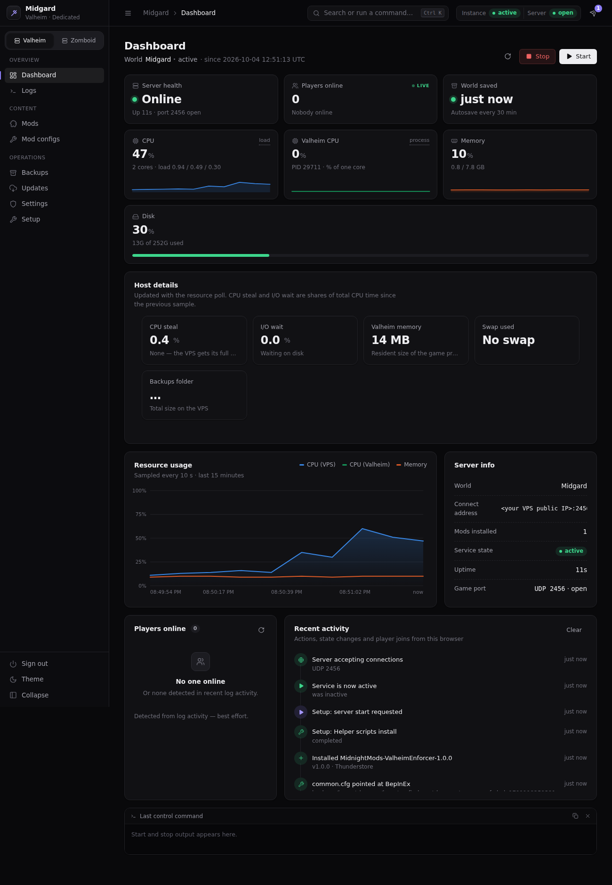
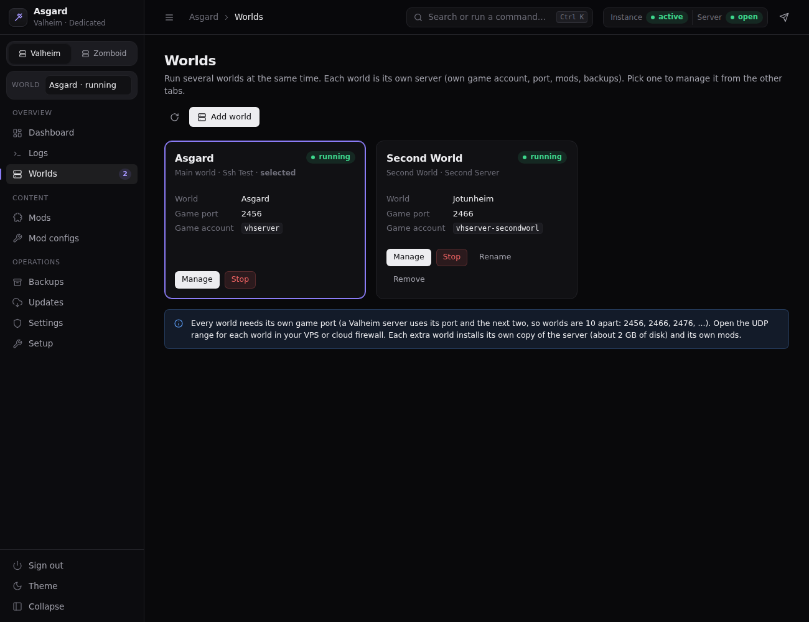
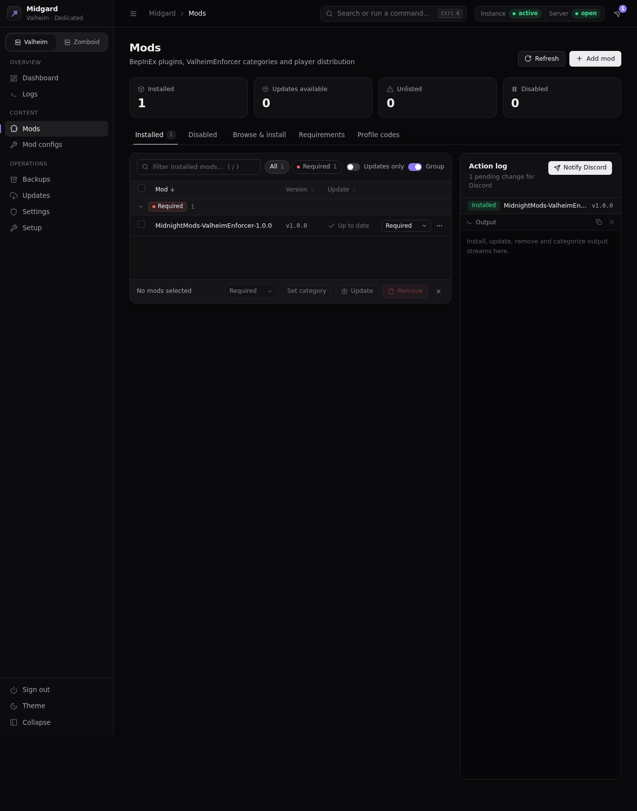

# Valheim Modded Server Manager

A web dashboard that takes a fresh Linux VPS to a running **modded Valheim dedicated server**, then helps you run it: start and stop, mods, backups, updates, logs, settings, and several worlds side by side.

It manages the stack most modded servers use: [LinuxGSM](https://linuxgsm.com) runs the game, [BepInEx](https://github.com/BepInEx/BepInEx) loads the mods, and [ValheimEnforcer](https://thunderstore.io/c/valheim/p/MidnightMods/ValheimEnforcer/) decides which mods players must have.



> **Status:** used in production on one VPS, and the fresh-install flow and multi-world support were tested end to end against a real Ubuntu 24.04 with real LinuxGSM and a simulated Steam and Thunderstore. A first install against the real Steam and Thunderstore on a brand-new VPS has not been through the same testing, so try it on a throwaway VPS first. See [Limitations](#limitations).

## Features

- **Guided setup (Setup tab).** Eight steps with live output take Ubuntu or Debian from nothing to a running modded server: LinuxGSM, the Valheim server, name/world/password/port, BepInEx, the `common.cfg` wiring (previewed and backed up first), ValheimEnforcer and its dependencies, helper scripts, and a start-and-verify check. A checklist shows when everything is up.
- **Several worlds at once.** Each extra world is its own isolated instance (own game account, files, mods, port, backups and schedules). A world switcher in the sidebar points every tab at one world, and a world can be uninstalled from the VPS again (account, files, jobs and firewall rule) with an optional backup copy.
- **Mods.** List what is installed, check for updates against Hexium and Thunderstore, install and update with a Source/Author/Version prompt, disable, remove, and recategorize mods for ValheimEnforcer. Dependencies are checked, and Gale deep links make joining easy.
- **Player codes.** Generate Gale profile codes for players and admins straight from the installed mods, from the GUI or, optionally, with a `/codes` command in Discord.
- **Backups.** Run, list and restore backups; schedule them with cron on the VPS (skipped when the server is stopped or, if you choose, while players are online). Server updates take a backup first and stop if it fails.
- **Updates.** Check for a new Valheim build and apply it behind the backup gate, with optional scheduled checks.
- **Dashboard and logs.** Server status, CPU, memory and disk charts, a live best-effort players-online list, world-saved health, and live log streaming.
- **Settings.** Server name, password, port, autosave and world modifiers; admin, ban and permitted lists; a mod config editor for BepInEx `.cfg` files.
- **Discord notifications** for backup failures, update availability and mod changes (optional), set up from the Settings tab with separate status and changes channels.
- **Optional Discord bot** that answers `/codes` for any world, installed and removed from the GUI.
- **Safe by default.** Login with a hashed password, localhost-only binding, a restart-required banner, and a `.bak.<timestamp>` copy before any config file is changed.
- **Optional Project Zomboid tab** for people who run both games.

| Worlds | Mods |
| --- | --- |
|  |  |

## Requirements

- **Where the GUI runs:** [Node.js](https://nodejs.org) 18 or newer, on your own PC or on the VPS.
- **The server:** a VPS with **Ubuntu or Debian**, root SSH access (or run the GUI on the VPS in local mode), about 4 GB of RAM for one world and 10 GB or more of free disk. Each extra world needs roughly 2 GB more disk and more RAM.
- **Network:** UDP ports for each world (2456-2458 for the first world). The GUI opens and closes them in `ufw` for you when `ufw` is active; a firewall in your hosting provider's panel is separate and must be opened there.

## Quick start

```bash
git clone https://github.com/Variance27/valheim-modded-server-manager.git
cd valheim-modded-server-manager
npm install
cp config.example.json config.json     # on Windows: copy config.example.json config.json
```

Edit `config.json` with your VPS address, user and password (or key), then:

```bash
npm start
```

Open <http://localhost:4173>. The first start prints a one-time admin password in the terminal. Sign in, open the **Setup** tab, and work through the eight steps from top to bottom.

For the full walkthrough, see [Getting started](docs/GETTING_STARTED.md).

## Documentation

| Guide | What it covers |
| --- | --- |
| [Getting started](docs/GETTING_STARTED.md) | Fresh VPS to a running server, step by step, and how to tell it is up |
| [Configuration](docs/CONFIGURATION.md) | Every `config.json` key |
| [Features](docs/FEATURES.md) | What each tab does |
| [Multiple worlds](docs/MULTIPLE_WORLDS.md) | Running more than one world on one VPS |
| [Mods and ValheimEnforcer](docs/MODS_AND_ENFORCER.md) | How mods are matched, categorized, updated and turned into player codes |
| [Backups and scheduling](docs/BACKUPS_AND_SCHEDULING.md) | Backups, restore, cron jobs and Discord alerts |
| [Discord bot](docs/DISCORD_BOT.md) | The optional `/codes` bot and how to set it up |
| [VPS helper scripts](docs/VPS_SCRIPTS.md) | The scripts installed on the VPS and how they work |
| [Troubleshooting](docs/TROUBLESHOOTING.md) | Fixes for problems seen in real use |
| [Architecture](docs/ARCHITECTURE.md) | How the GUI is built, for contributors |
| [Security](SECURITY.md) | Hardening advice and how to report a problem |

## Security notes

- The GUI controls a root-capable connection to your VPS. It listens on `127.0.0.1` only; keep it that way or put it behind HTTPS (SSH tunnel, Tailscale, Cloudflare Tunnel) and set `"trustProxy": true`.
- `config.json` holds your VPS password in plain text and `auth.json` holds the GUI login hash. Both are in `.gitignore`. Never commit or share them. Prefer an SSH key (`ssh.privateKeyPath`) over a password.
- Read [SECURITY.md](SECURITY.md) before exposing anything beyond localhost.

## Limitations

- Ubuntu and Debian only. The Setup tab needs root.
- Steam, Thunderstore, Hexium and ValheimEnforcer are external services and projects. If they change their formats, parts of this tool may need updating.
- The players-online list is derived from log lines because Valheim has no player API; it can be briefly wrong after a crash.
- The tool is not affiliated with Iron Gate Studio, LinuxGSM, BepInEx, Thunderstore, Hexium or the ValheimEnforcer author.

## Contributing

Issues and pull requests are welcome. See [CONTRIBUTING.md](CONTRIBUTING.md).

## License

[MIT](LICENSE) © 2026 JD Quinones
