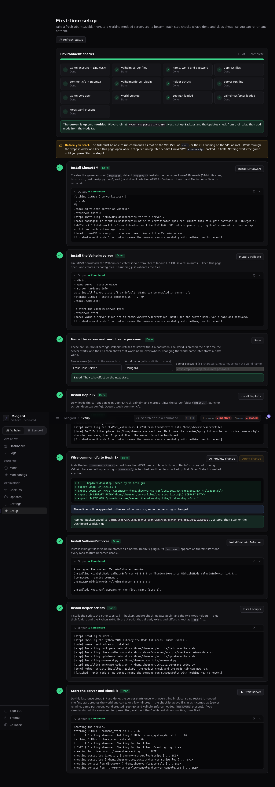

# Getting started: fresh VPS to a running modded server

This guide takes you from a brand-new **Ubuntu or Debian** VPS to a modded Valheim server you manage from your browser. If your server already runs Valheim, BepInEx and ValheimEnforcer under LinuxGSM, you can skip the Setup tab and just point the GUI at it (see [Configuration](CONFIGURATION.md)).

Nothing runs by itself. Each step has its own button with live output, and a checklist at the top of the Setup tab shows what is done. **Work through the steps in order and no restart is ever needed**: the server is started once, at the very end.



## Before you start

1. A VPS with Ubuntu or Debian, at least 4 GB of RAM, about 10 GB of free disk, and root SSH access. Other distributions are not supported by the Setup tab.
2. [Node.js](https://nodejs.org) 18 or newer on the machine that runs the GUI (your PC, or the VPS itself).
3. Copy `config.example.json` to `config.json` and fill in your VPS address and login. A fresh server needs nothing else; every other setting has a default.

   ```json
   {
     "ssh": { "host": "YOUR.VPS.IP", "port": 22, "username": "root", "password": "your-vps-password" },
     "guiPort": 4173,
     "publicHost": "YOUR.VPS.IP"
   }
   ```

   An SSH key works too: use `"privateKeyPath"` instead of `"password"`.
4. Run `npm install`, then `npm start`, and open <http://localhost:4173>. The first start prints a one-time admin password in the terminal; copy it, because it is not shown again.
5. Open the **Setup** tab.

The GUI has to connect as `root` (or run as root with `"mode": "local"`), because Setup installs packages and creates the game account. The game itself never runs as root.

## The eight steps

| # | Step | What it does |
| --- | --- | --- |
| 1 | **LinuxGSM** | Creates the `vhserver` account, installs the 32-bit libraries and tools LinuxGSM needs (tmux, curl, steamcmd and so on) and downloads LinuxGSM. A minute or two. |
| 2 | **Valheim server** | LinuxGSM downloads the dedicated server from Steam (1 to 2 GB). Keep the page open. |
| 3 | **Name, world, password, port** | The server name shown in the browser list, the world name (letters, digits, `.`, `_`, `-`), a password of at least 5 characters that does not contain the world name (Valheim refuses to start otherwise), and the game port. The world is created on first start with the name you chose, and the GUI then shows that name everywhere instead of the generic "Valheim". |
| 4 | **BepInEx** | Downloads the current BepInEx pack from Thunderstore into the server folder. |
| 5 | **Wire common.cfg** | Press **Preview** to see the four `DOORSTOP_*` and `LD_*` lines, then **Apply**. `common.cfg` is backed up first, and the step does nothing if it is already wired. |
| 6 | **ValheimEnforcer** | Installs the plugin **and the libraries it depends on** (Jotunn and others) through the same installer the Mods tab uses. Without its dependencies BepInEx refuses to load Enforcer. |
| 7 | **Helper scripts** | Installs the backup, update-check, update and mod scripts into `/home/vhserver/scripts`, plus the Python YAML libraries. A script that already exists and differs is kept as `.bak.<timestamp>` first. |
| 8 | **Start and verify** | Press **Start server**. The first start creates the world and can take a few minutes; the checklist fills in by itself. |

## How you know it is up

The checklist reaches **all green** and a banner says "The server is up and modded". That means the server process is running, the game port is open, the world file exists, BepInEx and ValheimEnforcer both loaded, and ValheimEnforcer wrote its `Mods.yaml`. Then:

- The **Dashboard** shows status `active`, and the sidebar title changes from "Valheim" to your world name.
- Players connect with `<your VPS public IP>:2456`. Set `publicHost` in `config.json` so the Dashboard shows the address with a copy button.
- **Open the firewall.** A Valheim server uses its port and the next two (2456-2458 for the first world), all UDP. Open them on the VPS and in your provider's firewall if it has one:

  ```bash
  sudo ufw allow 2456:2458/udp     # only needed if ufw is active; check with: sudo ufw status
  ```

  The GUI cannot open your provider's firewall for you.

## After setup

- Open **Backups** and set a schedule, and **Updates** for update checks. These create cron jobs on the VPS, so they keep working when the GUI is closed.
- Add mods from the **Mods** tab. If the server is running, the GUI shows "restart needed": press Stop, wait for `inactive`, then Start. The GUI never offers Restart so the world is always saved first.
- Optional: set `discordWebhookUrl` and `discordStatusWebhookUrl` in `config.json`, and `CLOUD_REMOTE=<rclone remote>:<folder>` in `/home/vhserver/.config/valheim-notify.conf` for off-site backups. Without it, backups stay on the VPS.

## If something fails

- Every step is safe to run again.
- A failed step prints the reason in its output box. The usual causes are no internet access from the VPS or a full disk.
- If Start fails with "Ownership issues found", the GUI repairs file ownership and retries once on its own.
- To undo step 5, restore the newest `common.cfg.bak.<timestamp>` next to `common.cfg`.
- By hand: `sudo -u vhserver /home/vhserver/vhserver details`.
- More fixes are in [Troubleshooting](TROUBLESHOOTING.md).

## A second world

Use **Worlds, then Add world**. See [Multiple worlds](MULTIPLE_WORLDS.md).
